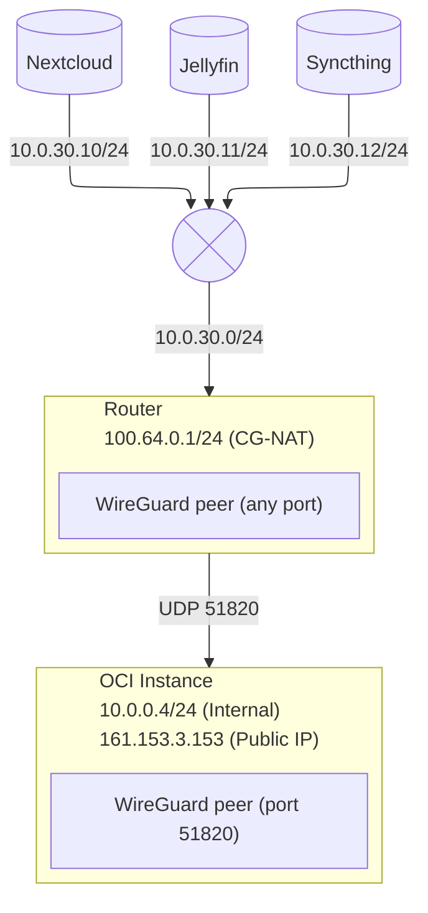

### Table of contents
- [[index|Introduction]]
- [[cloud-setup|Part 1. Cloud Setup]]

In today’s day and age, there aren’t many ISPs that still provide public IPs for its users. This can be a challenge to fellow homelab enthusiasts that seek to host services in their own hardware.

Luckily, this limitation can be surpassed free-of-charge by utilizing a combination of a WireGuard tunnel, Oracle Cloud’s Always-Free services, and the incredibly powerful NixOS.

**Local**
In this setup, the local homelab network has all the services that should be exposed separated into the separate subnet 10.0.30.0/24. The WireGuard instance in the remote OCI instance will only have access to this subnet, limiting the scope of potential attacks on the former.

**Cloud**
The cloud instance has WireGuard listening on port 51820 with an open firewall firewall port both in *iptables* and in the OCI’s subnet security settings.

[[cloud-setup|Next >>]]